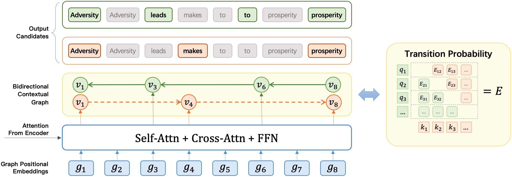
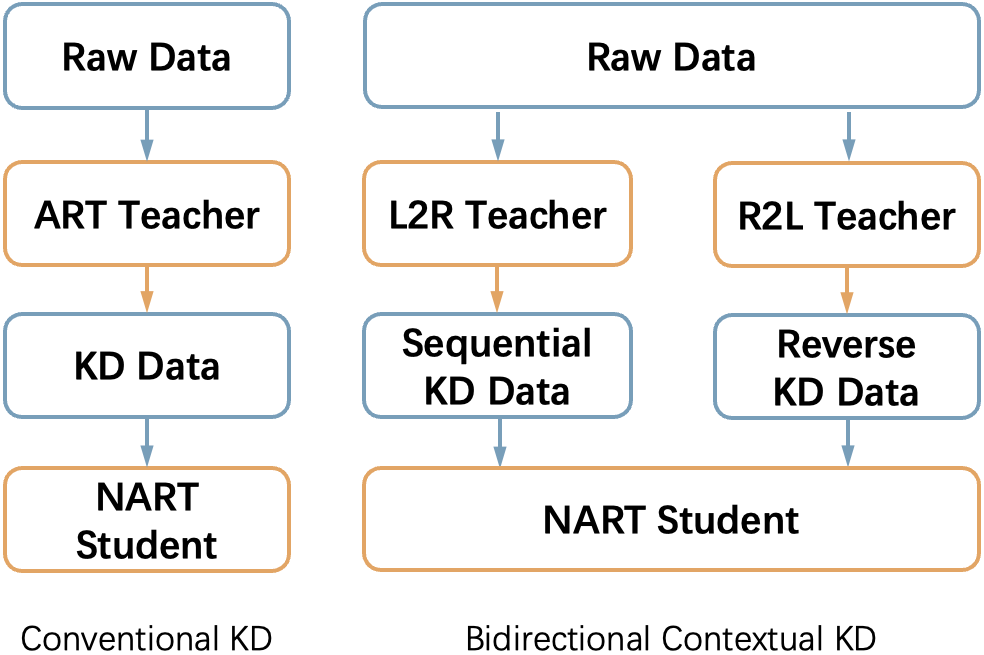

# NART-DIR-Bias

Implementation for the paper "**Alleviating Directional Bias in Non-Autoregressive Transformers**" (IJCNN 2025).
## Background
#### Abstract 

Non-Autoregressive Transformer (NART) has emerged as a promising approach for fast neural machine translation due to its independent and parallel nature during inference. 
Early works have improved NART by integrating directional token dependency information. 
However, the outcome of NART is still unsatisfactory against those of the Autoregressive Transformer (ART) models. One of the contributions of this paper is the observation of \textit{Directional Bias}, the propagation of exposure bias into NAR models through the directional token dependency adopted, which leads to low transition quality and should be minimized.
In light of this, this paper incorporates future context information into both Conventional Knowledge Distillation (CKD) and Directed Acyclic Transformer (DA-T) frameworks, whereby proposes Bidirectional Contextual Knowledge Distillation (BCKD) and Bidirectional Contextual Transformer (BC-T): 
BCKD employs dual AR teacher models with opposite inference directions (L2R/R2L) to reduce Directional Bias in CKD datasets, while BC-T replaces the directed acyclic graph of DA-T with a bidirectional graph, which captures bidirectional token dependency information, and performs translation via bidirectional ensemble search. 
Experimental results reveal that BC-T achieves comparative translation quality against ART models while preserving the high generation efficiency, inherent to DA-T.
Furthermore, BCKD enhances the generation quality of a diverse spectrum of NART models, including GLAT and CMLM. More intriguingly, the BC-T model equipped with BCKD exhibits superior performance compared to ART models, achieving an improvement of 0.97 BLEU points. 

#### Proposed Methods
* The BC-Transformrer extends the DA-Transformer in a bidirectional architecture.



* The BCKD uses two symmetrical Autoregressive Transformers as the teacher model to generate the KD dataset.



#### Practical Advantages 
* BCKD further boosts a wide group of NART models (CMLM/GLAT/BC-T) than original KD methodology.
* BC-Transformer achieves the translation quality comparable with ART models in **all language pairs (Ee-De/En-Ro) without Knowledge Distillation**.
* BC-Transformer can be further improved via BCKD and outperforms the DA-T(with KD) by 0.9 BLEU.
* Both methods (BCKD & BC-Transformer) preserve the generation speedup of the NART models.

#### **BCKD Datasets**
* We release the BCKD dataset of WMT14 En-De/De-En, WMT16 En-Ro/Ro-En.
* Refer to the following link for BCKD data downloading:
   [https://drive.google.com/drive/folders/1z3aw0ZiFTmpTWP8cc4mgnRcKCVKvQhdz?usp=sharing](https://drive.google.com/drive/folders/1foHdMQID-BewDAXNOKIj2Q4z3SlcRQLJ?usp=drive_link)
#### **BC-Transformer Codes**
This repo is modified from [``DA-Transformer/v1.0``](https://github.com/thu-coai/DA-Transformer/tree/v1.0), please see the original documentation for more information.

#### Features:

* We extend the original DA-Transformer model with a bidirectional training loss. 
* We extend the original L2R directional beam search to the bidirectional ensemble search (BES). 

## Setup Guidance
#### Requirements & Installation

* Python >= 3.7
* Pytorch == 1.12.1 (tested with cuda ==  11.3)
* gcc >= 7.0.0 (for compiling cuda operations. See FAQs if you want to use a lower gcc version)
* ``git clone && pip install -e .``
* BeamSearch algorithm for BC-Transformer (``cd dag_search && bash install.sh``)

## Main Files

Most codes of the framework are from Fairseq. We mainly add the following files.
#### setupScript 

`setupScript` contains the scripts of preprocess/training/evaluation/generation of WMT14 De-En Dataset.
#### fs_plugins

```
fs_plugins
├── criterions
│   ├── nat_dag_loss.py                   # L2R DA-Transformer loss
│   ├── reverse_dag_loss.py               # R2L DA-Transformer loss
│   ├── bi_dag_loss.py                    # BC-Transformer loss
├── custom_ops                            # operations implementations and cuda kernels
│   ├── dag_best_alignment.cu
│   ├── logsoftmax_gather.cu
│   ├── dag_loss.cu
│   ├── dag_loss.py
│   ├── rev_dag_loss.py
│   └── dag_loss.cpp
├── models
│   ├── glat_decomposed_with_link.py      # A PyTorch implementation of L2R DA-Transformer
│   ├── glat_decomposed_with_link_Rev.py  # A PyTorch implementation of R2L DA-Transformer
│   ├── bi_glat_decomposed_with_link.py   # A PyTorch implementation of BC-Transformer
│   ├── ls_glat_decomposed_with_link.py   # A lightseq implementation of DA-Transformer
│   └── ls_*                              # Other files required for lightseq
├── optimizer
│   └── ls_adam.py                        # Lightseq Adam
├── scripts
│   ├── test_tradeoff.py                  # Parameter search script used in BeamSearch
│   ├── average_checkpoints.py            # Average checkpoints tricks
|   └── convert_ls_to_fairseq.py          # Converting lightseq model to fairseq model
└── tasks
    └── translation_lev_modified.py
```

#### BeamSearch on DAG

We extend [dag_search](https://github.com/thu-coai/DAG-Search) to implement the Bidirectional Ensemble BeamSearch algorithm.

#### Data Preprocessing

Please follow the [instruction](https://github.com/facebookresearch/fairseq/tree/main/examples/translation#wmt14-english-to-german-convolutional) in Fairseq to prepare the data. For BCKD, download the dataset via the link above.


#### Training

**We use a batch size of approximating 64k tokens, so the GPU number * max_tokens * update_freq should be 64k.**

For example, **if you have 4 V100-32 GPUs**, run the following script for training:

```bash
data_dir=$PROCESSED_DATA_DIR
checkpoint_dir=$CHECKPOINT_SAVING_DIR
fairseq-train ${data_dir}  \
    --user-dir ../DA-Transformer/fs_plugins \
    --task translation_lev_modified  --noise full_mask \
    --arch bi_glat_decomposed_link_base \
    --decoder-learned-pos --encoder-learned-pos \
    --share-all-embeddings --activation-fn gelu \
    --apply-bert-init \
    --links-feature feature:position:share --decode-strategy lookahead \
    --max-source-positions 128 --max-target-positions 1024 --src-upsample-scale 8.0 \
    \
    --criterion bi_nat_dag_loss \
    --length-loss-factor 0 --max-transition-length 99999 \
    --glat-p 0.5:0.1@200k --glance-strategy number-random \
    \
    --optimizer adam --adam-betas '(0.9,0.999)' --fp16 \
    --label-smoothing 0.0 --weight-decay 0.01 --dropout 0.1 \
    --lr-scheduler inverse_sqrt  --warmup-updates 10000   \
    --clip-norm 0.1 --lr 0.0005 --warmup-init-lr '1e-07' --stop-min-lr '1e-09' \
    --ddp-backend c10d --torch-dag-loss --torch-dag-best-alignment --torch-dag-logsoftmax-gather  \
    \
    --no-epoch-checkpoints \
    --max-tokens 1639  --update-freq 10 --grouped-shuffling \
    --max-update 300000 --max-tokens-valid 1639 \
    --save-interval 1  --save-interval-updates 2215  \
    --keep-interval-updates 200 \
    --skip-invalid-size-inputs-valid-test \
    --seed 0 \
    --save-dir ${checkpoint_dir} 
```

#### Speed up 
Due to the limitation of development resources, we didn't expand the cuda operation and lightseq accellaration. 
Use the 
```--torch-dag-loss --torch-dag-best-alignment --torch-dag-logsoftmax-gather```
to enable the pytorch implementation.

#### Inference

BC-Transformer provides the Bidirectional Ensemble Searching, in which the beam-search candidate list is partitioned into two identical segments to accommodate two sets of candidates, with the most probable one selected as the model output.
The BES contains parameters:

* **decode_beamsize**:  Beam size of one directional partitions. The total beam size is `2 * decode_beamsize`. 
* **decode_direction**: Contains three selections, the `'forward'` and `'backward`' and `'bidirection'`. The `'forward'` and `'backward'` performs a L2R and R2L directional Beam Search on BC Graph, while the `'bidirection'` performs the BES on BC-Graph.
```bash
fairseq-generate  ${data_dir} \
    --gen-subset test --user-dir fs_plugins --task translation_lev_modified \
    --iter-decode-max-iter 0 --iter-decode-eos-penalty 0 --beam 1 \
    --remove-bpe --batch-size 16 --seed 0 --skip-invalid-size-inputs-valid-test\
    --model-overrides "{\"decode_strategy\": \"beamsearch\", \"decode_beta\": 1.1, \
        \"argmax_token_num\":5, \
        \"decode_alpha\": 1.4, \"decode_gamma\": 0, \
        \"decode_lm_path\": None, \
        \"decode_beamsize\": 200, \"decode_top_cand_n\": 5, \"decode_top_p\": 0.9, \
        \"decode_max_beam_per_length\": 10, \"decode_max_batchsize\": 32,  \"decode_dedup\": True, \"decode_direction\": \"bidirection\" }" \
    --path ${average_checkpoint_path} > Generate.Beam.Bidir.1.4.out
```

#### Average Checkpoints

We average the parameters of the best 5 checkpoints evaluated by the bidirectional lookahead inference.
Evaluation scripts shown in `setupScript/Inference_Valid_bi.py`.


#### BeamSearch

Please install dag_search first, see ``./dag_search/install.sh`` for requirements.

## Citing

Please kindly cite us if you find our papers or codes useful.
